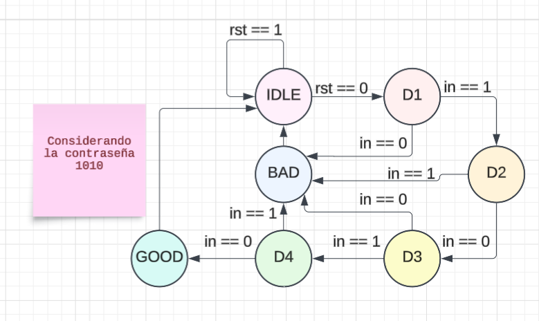
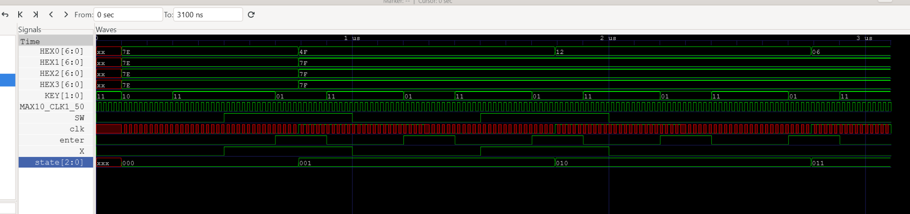

A01639462 Sophia Leñero Gómez

# Práctica 4 - FSM Contraseña

## Descripción
Para esta práctica, se pedía que se implementara un sistema con Verilog HDL que utilizara una Máquina de estados finitos para validar una contraseña de 4 bits. Al ingresar correctamente la contraseña el sistema tenía que ser capaz de mostrar en el display de 7 segmentos de una FPGA el mensaje de "_GOOD_" y en caso de ingresar algún digito mal, tenía que desplegarse el mensaje "_BAD_"

## Funcionamiento 
Para el sistema se utilizaron 4 módulos, los cuáles se explican a conitnuación;
BCD_module: módulo dedicado únicamente a los display de 7 segmento, donde se establece el funcionamiento de estos.
clk_divider: Crea un reloj que funciona en una frecuencia distinta a la frecuencia del reloj interno de la FPGA, transformando los 50MHz del MAX10_CLK1_50 a un reloj dividido de 5MHz.
Password: Este módulo es sumamente importante, ya que en el se encuentra la máquina de estados que implementa toda la lógica del sistema. En él, se define que hay 6 estados en total; Idle, D1(primer dígito ingresado), D2(segundo dígito ingresado), D3(tercer dígito ingresado), D4(cuarto dígito ingresado), GOOD y BAD. 
top: Este módulo funge como top entity module, juntando todos los demás módulos en una jerarquía para juntar todo ahí. 

## Máquina de estados
La máquina de estados utilizada para esta práctica va acorde al siguiente diagrama; 

## Test bench 
Para verificar que el sistema estuviera funcionando de manera adecuada, se realizó un test bench usando OSS CAD, GTKWAVE. En esta simulación se genera una señal periódica que emula el reloj de la FPGA y se inicializan las entradas del sistema. Después, se simula un reset para mandar la FSM a estado inicial IDLE. Posteriormente se introduce la secuencia de bits de la contrseña mediante el switch SW0 y activando enter con KEY1 para registrar cada entrada. Durante la simulación se pretendía monitorear especialmente selakes internas como state y las salidas hacia los displays. 
A continuación se adjunta un screen shot de la simulación, donde se puede ver que se cambia exitosamente de estado, asegurando que la fsm esta funcionando adecuadamente 

## Demostración del funcionamiento
A continuación se presenta un video de demostración del funcionamient del sistema, en donde primero se ingresa la contraseña correcta, luego reset y dos pruebas de contraseñas incorrectas. https://drive.google.com/file/d/15mQ-igYbf9wIuRT47qRnGspwl19q9UKZ/view?usp=drivesdk

## Conclusiones
A manera de conclusión, en esta práctica se ideó, implementó y probó el diseño de una FSM dedicada al ingreso de una contraseña y su correcta validación. Es una práctica en verdad altamente relevante porque permite ver los usos de las FSMs en contextos prácticos de la vida cotidiana. 
